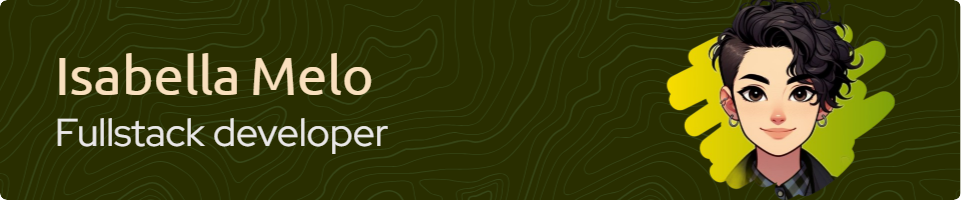

##  
 👋 Hi! I’m Isabella Melo, welcome to my `GitHub profile` (●'◡'●).

  
<!--   -->

 

 
I'm a Full Stack Developer and Computer Science student.

 
Lately, I’ve been diving deeper into programming and exploring new technologies across this ever-evolving field. My GitHub profile is like my digital notebook, where I document my learning journey, share projects, and continuously refine my skills.

 
Feel free to reach out if you have any questions, suggestions, or just want to connect! You’ll find my contact information in the "Connect with me" section below.

 
I hope my repositories are helpful and inspire you in your own coding journey. Happy browsing – and may the code be with you!</strong> 

 

## Languages
<!-- https://devicon.dev/ -->

 
 
 
 
 
<!--   -->

## Frameworks and Platforms

### Frontend

 
 
 
 
          
 

### Backend

 
 
 
 
<!--   -->

## Tools

 
 
 
 
 
 
 

## Operating Systems

## Connect with me

[][linkedin]
[][gmail] 

[linkedin]: https://www.linkedin.com/in/isabella-cpmelo/
[gmail]: mailto:isacpmelo@gmail.com

## Stats

 <a href="https://github.com/isabellacpmelo">
 
 

<!--  -->
  

 
 
 
<!--
**isabellacpmelo/isabellacpmelo** is a ✨ _special_ ✨ repository because its `README.md` (this file) appears on your GitHub profile.
https://img.icons8.com/color/48/000000/python.png
![snake gif]https://github.com/isabellacpmelo/isabellacpmelo/blob/output/github-contribution-grid-snake.svg

Here are some ideas to get you started:

- 🔭 I’m currently working on ...
- 🌱 I’m currently learning ...
- 👯 I’m looking to collaborate on ...
- 🤔 I’m looking for help with ...
- 💬 Ask me about ...
- 📫 How to reach me: ...
- 😄 Pronouns: ...
- ⚡ Fun fact: ...
-->
